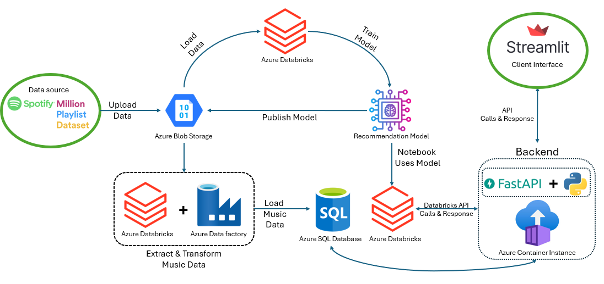
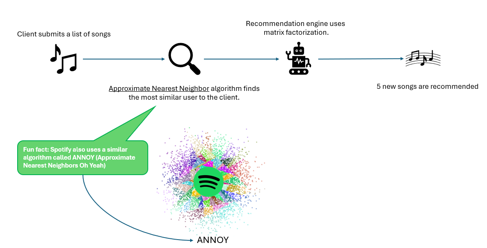

# Loopify-Music-Recommender-System
*Inspired by Spotify's Recommendation Algorithm*

## Goal
To build a music recommendation engine using Spotify Million Playlist Data (30 GB) and host its API on cloud.

## Product Demo

### 🎵 Loopify - Your Smart Music Companion! 🎵

Discover your next favorite track with Loopify, a sleek and intuitive music recommendation platform that helps you find the perfect soundtrack for any moment. With its clean, Spotify-inspired design, Loopify offers a seamless music discovery experience.

### ✨ Key Features
- **Smart Search:** Easily find songs by track name, artist, or album
- **Comprehensive Results:** View detailed track information in a clear, organized table
- **Elegant Interface:** Dark mode design that's easy on the eyes

### 🎧 How It Works
Simply type in what you're looking for, hit "Search Songs," and let Loopify guide you to your next musical adventure. It's that simple!

---

*Perfect for music enthusiasts who love discovering new tunes and expanding their musical horizons. Find your vibe with Loopify's music recommendation system today!*

## Technology Used
- Python
- PySpark
- FastAPI
- Streamlit
- Docker
- Azure Cloud Services (Only key components are listed)
  - Azure SQL Database
  - Azure Datafactory
  - Azure Databricks
  - Azure Container Instance
  - Azure Blob Storage

## Architecture

## Recommendation Engine Specifics

## References
1. https://github.com/tmscarla/spotify-recsys-challenge/blob/master/Paper.pdf (This paper uses CF but only the neighborhood methods and not matrix factorization is used in this paper)
2. GitHub Repo with resources on collaborative filtering: https://github.com/mrthlinh/Spotify-Playlist-Recommender/tree/master?tab=readme-ov-file#reference
3. NDCG metric - https://www.youtube.com/watch?v=BvRMAgx0mvA
4. R-precision - https://www.youtube.com/watch?v=A0K3K4fOvY8&t=21s
5. Original Spotify Approach: https://www.slideshare.net/slideshow/algorithmic-music-recommendations-at-spotify/29966335#3 
6. Original Spotify Approach 2: https://www.slideshare.net/slideshow/cf-models-for-music-recommendations-at-spotify/53258240
7. Author of Spotify RecSys: https://www.youtube.com/watch?v=Q8W2IGiSdhc
8. This is faster library than SparkMlib that does recommender algorithm It also has nice resources to referhttps://github.com/benfred/implicit
9. This paper discusses about the matrix factorization method for implicit features and is the base for Spotify’s recommendation algorithm. (http://yifanhu.net/PUB/cf.pdf)
10. An example for best practices for CF for movielens using spark mllib https://github.com/recommenders-team/recommenders/blob/main/examples/02_model_collaborative_filtering/als_deep_dive.ipynb

